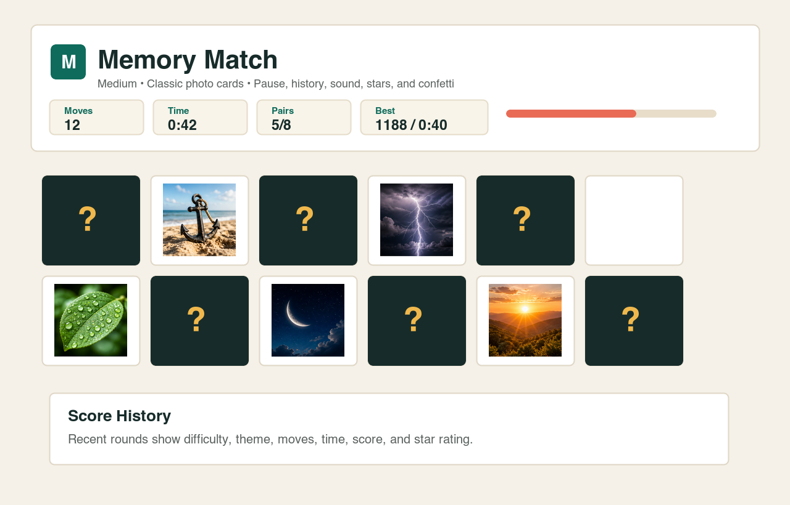
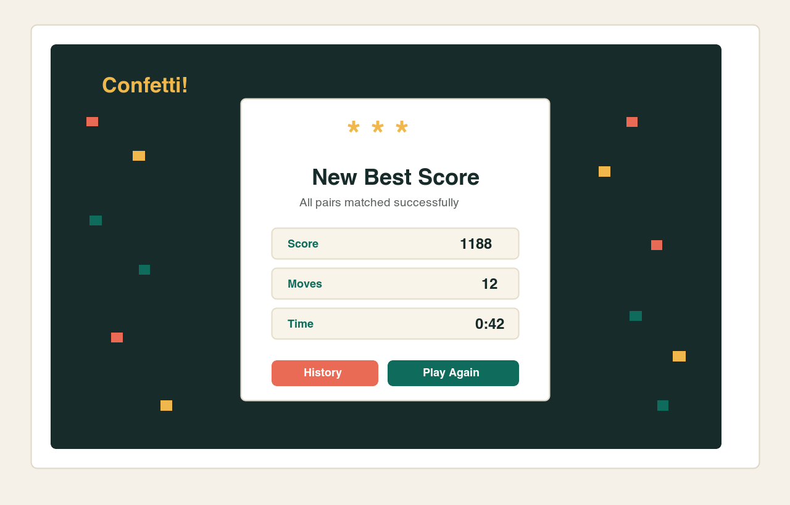

# Memory Matching Flutter Game

This is my Flutter/Dart memory matching game for the 30-point challenge. The idea is simple: flip two cards, remember where each image is, and match every pair. The app keeps track of moves, time, progress, score, and the best result from the current play session.

I built the project so it can be opened directly in Android Studio and run on an Android Emulator. It also works in Chrome for quick testing.

## What The App Includes

- A clean start screen where the player can choose difficulty and card theme before starting.
- Easy, Medium, and Hard modes with different numbers of card pairs.
- Four card themes: Classic, Space, Nature, and Cafe.
- Real photo-style picture assets for the Classic theme.
- Animated card flipping and patterned card backs.
- Pause/resume support. When the game is paused, the cards are hidden.
- Timer, move counter, pair progress, restart button, and best score display.
- A score history dialog for completed rounds in the current session.
- A win dialog with score, moves, time, and star rating.
- Confetti animation when all pairs are matched.
- Sound and haptic feedback for taps, matches, misses, and wins.
- A custom app launcher icon instead of the default Flutter icon.
- Responsive layout for Android Emulator, iOS, and Chrome/web.

## How To Run The Project

Before running the app, make sure Flutter is installed and Android Studio is set up with an emulator.

1. Install Flutter from `https://docs.flutter.dev/get-started/install`.
2. Open Android Studio.
3. Choose `File > Open`.
4. Select this project folder:

   ```text
   /Users/dhruvpatel/Documents/EXE2
   ```

5. Open the terminal in Android Studio or use your system terminal inside this folder.
6. Run:

   ```bash
   flutter pub get
   ```

7. Start an Android Emulator from `Tools > Device Manager`.
8. Run the app on the emulator:

   ```bash
   flutter run
   ```

For a browser preview, you can also run:

```bash
flutter run -d chrome
```

## Running From Android Studio

This is the easiest way to present the project in class:

1. Open Android Studio.
2. Open the folder `/Users/dhruvpatel/Documents/EXE2`.
3. In the left project panel, switch the dropdown to `Project`.
4. Open `lib/main.dart`.
5. Select an Android Emulator from the device dropdown.
6. Click the green Run button.

If the emulator still shows the old Flutter icon, uninstall the app from the emulator and run it again. Android sometimes caches launcher icons.

## Useful Commands

These are the commands I used to check the project:

```bash
flutter analyze
flutter test
flutter build apk --debug
```

The debug APK is generated at:

```text
build/app/outputs/flutter-apk/app-debug.apk
```

## Project Structure

The project is organized so the main game logic is not all in one file. `main.dart` only starts the app, and the actual game code is grouped under `lib/src/`.

```text
memory_matching_game/
|-- .metadata
|-- android/
|   |-- app/
|   |   |-- build.gradle.kts
|   |   `-- src/
|   |       |-- debug/AndroidManifest.xml
|   |       |-- main/
|   |       |   |-- AndroidManifest.xml
|   |       |   |-- java/io/flutter/plugins/GeneratedPluginRegistrant.java
|   |       |   |-- kotlin/com/example/memory_matching_game/MainActivity.kt
|   |       |   `-- res/
|   |       |       |-- drawable/launch_background.xml
|   |       |       |-- drawable-v21/launch_background.xml
|   |       |       |-- mipmap-hdpi/ic_launcher.png
|   |       |       |-- mipmap-mdpi/ic_launcher.png
|   |       |       |-- mipmap-xhdpi/ic_launcher.png
|   |       |       |-- mipmap-xxhdpi/ic_launcher.png
|   |       |       |-- mipmap-xxxhdpi/ic_launcher.png
|   |       |       |-- values/styles.xml
|   |       |       `-- values-night/styles.xml
|   |       `-- profile/AndroidManifest.xml
|   |-- build.gradle.kts
|   |-- gradle/wrapper/gradle-wrapper.jar
|   |-- gradle/wrapper/gradle-wrapper.properties
|   |-- gradle.properties
|   |-- gradlew
|   |-- gradlew.bat
|   `-- settings.gradle.kts
|-- assets/
|   |-- icons/
|   |   `-- app_icon.png
|   `-- images/
|       |-- anchor.png
|       |-- bolt.png
|       |-- camera.png
|       |-- compass.png
|       |-- leaf.png
|       |-- moon.png
|       |-- rocket.png
|       |-- star.png
|       |-- sun.png
|       `-- wave.png
|-- ios/
|-- lib/
|   |-- main.dart
|   `-- src/
|       |-- app.dart
|       |-- models/
|       |   `-- game_models.dart
|       |-- screens/
|       |   |-- memory_game_page.dart
|       |   `-- start_screen.dart
|       `-- widgets/
|           |-- confetti_painter.dart
|           |-- game_cards.dart
|           |-- game_dialogs.dart
|           `-- game_header.dart
|-- linux/
|-- macos/
|-- screenshots/
|   |-- game_board.png
|   `-- win_dialog.png
|-- test/
|   `-- widget_test.dart
|-- web/
|-- windows/
|-- analysis_options.yaml
|-- pubspec.lock
|-- pubspec.yaml
|-- README.md
`-- README.pdf
```

Generated folders such as `build/`, `.dart_tool/`, `.idea/`, and Gradle cache folders are not required for submission because Flutter and Android Studio can recreate them.

## Main Dart Files

- `lib/main.dart`: Starts the Flutter app.
- `lib/src/app.dart`: Sets up the Material app theme and connects the app to the game page.
- `lib/src/models/game_models.dart`: Contains the data models, card themes, difficulty settings, score records, and round results.
- `lib/src/screens/memory_game_page.dart`: Contains the main game state, timer, matching logic, pause/resume behavior, scoring, and win flow.
- `lib/src/screens/start_screen.dart`: Builds the start screen, card preview, theme selector, difficulty selector, and best-score summary.
- `lib/src/widgets/game_header.dart`: Contains the game header, stats, controls, and selectors used during gameplay.
- `lib/src/widgets/game_cards.dart`: Contains the card front, card back, animated card tile, paused card tile, and best-score display widgets.
- `lib/src/widgets/game_dialogs.dart`: Contains the win dialog and score-history dialog.
- `lib/src/widgets/confetti_painter.dart`: Draws the custom confetti animation after the player wins.
- `test/widget_test.dart`: Checks that the start screen loads and that the game board opens after pressing Start Game.

## Screenshots

### Game Board



### Win Dialog



## Verification Status

The project was checked with:

- `flutter analyze`: passed with no issues.
- `flutter test`: passed.
- `flutter build apk --debug`: Android debug APK built successfully.

## Submission Notes

For submission, use `memory_matching_game_solution.zip`. It includes the Flutter project source, Dart files, Android project files, image assets, screenshots, `README.md`, and `README.pdf`.

For the GitHub requirement, upload the full project folder to a public GitHub repository.
